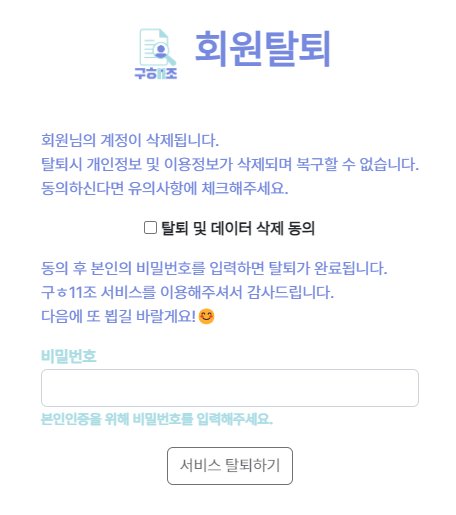

# 구ㅎ11조, 나의 Job! (Semi project2)

> - 크롤링으로 수집한 채용 공고를 제공하고 사용자 간 의견을 자유롭게 나눌 수 있는 커뮤니티를 서비스
> - 사용자 맞춤 세부 서비스: 쪽지보내기, 공고 스크랩, 좋아요, 팔로우/팔로잉


### 🔨 프로젝트 기간

* 2022.11.09(WED) ~ 2022.11.22(THU), **총 14일**


<div>
    <h3>📚 사용한 기술 STACKS</h3>
</div>

<div align=center>
    
    
    
     <br><br>

    
    
</div>


### 📚 사용한 API

- 데이터 크롤링 - BeautifulSoup, Selenium
- 고객센터 상담채팅 - Channel Talk


### 😎 총 5명의 프로젝트 팀원

- **팀장/프론트엔드**: 김명환 (https://github.com/myeonghwan57)
- **팀원1/프론트엔드**: 김현정 (https://github.com/hjkim1350)
- **팀원2/백엔드**: 김지영(https://github.com/jiyeong99)
- **팀원3/백엔드**: 강동현(https://github.com/kangdh208)
- **팀원4/백엔드**: 이진욱(https://github.com/mechauk418)


### 🕶️ 벤치마킹/레퍼런스 사이트

- **사람인** https://www.saramin.co.kr/
- **프로그래머스** https://programmers.co.kr/
- **점핏** https://www.jumpit.co.kr/
- **원티드** https://www.wanted.co.kr/


### ⚛️ 기능 설계

- **회원관리**
  - 회원가입
    - Input: 아이디, 비밀번호, 비밀번호 확인, 입사일자
    - 비밀번호 정책 적용 - 8자리 이상, 영문/숫자/특수문자 3가지 1개 이상 포함
    - 탈퇴한 회원 검증 및 1년 이내 재가입 불가
  - 로그인
    - ID/PW 로그인, 소셜로그인(Github, Google)
  - 로그아웃
    - 세션 삭제, 로그아웃 메시지 출력
  - 회원정보 수정
    - 프로필 사진 업로드, 이메일 주소 수정, Github 주소 수정, 비밀번호 변경
    - 내가 선호하는 태그 표시, 입사일로부터 현재까지의 경력 개월 수 표시
    - 사용자 간 쪽지 보내기/받기, 팔로잉/팔로워 확인
    - 내가 쓴 글/내가 쓴 댓글/좋아요한 글/스크랩한 글 모아보기
  - 회원 탈퇴
    - 탈퇴 전 확인 팝업, 탈퇴 안내 메시지 및 탈퇴 확인 목적의 본인 비밀번호 입력
    - 탈퇴 후 작성한 게시글, 댓글 삭제
    - 탈퇴 회원인지 여부 DB 내 1년 보관 및 1년 후 삭제
- **채용 공고**
  - 채용공고 데이터 수집
    - 크롤링: 회사명, 포지션, 공고 세부사항
  - INDEX
    - Carousel 배너 생성
    - 카드 형태 채용 공고 배치
    - 무한 스크롤
    - 페이지 Top 이동 버튼
  - 채용공고 세부페이지
    - 회사명, 포지션, 공고 세부사항 출력
    - 채용공고 내 랜덤이미지 출력
    - 북마크/공유
    - 댓글/대댓글 입력/수정/삭제
- **사용자 커뮤니티 게시판**
  - INDEX
    - 조회수 Top 4 게시글 배너형태 출력
    - 게시글 태그로 분류
    - 게시글 최신순/좋아요순/댓글순 정렬
    - 무한 스크롤
    - 페이지 Top 이동 버튼
  - 게시글 생성/수정/삭제/댓글
    - 대댓글/좋아요/태그/이미지 업로드
  - 검색어
    - 가장 많이 조회한 검색어 Top 4 출력
- **쪽지 송수신**
  - 사용자 조회 및 쪽지 보내기/받기/삭제
  - 쪽지 도착 시 badge로 쪽지 수 출력


### 📱 ERD 설계


### 📁 주요 source 파일 트리구조

```text
┌─📁 pjt (프로젝트 - setting 파일)
├─📁 accounts (회원관리 App)
├─📁 articles (채용 공고 App)
├─📁 posts (사용자 커뮤니티 App)
├─📁 static (이미지, CSS 파일)
├─🗒️ .gitignore (env, 가상환경 파일 git ignore)
├─🗒️ prac.json (채용공고 크롤링 수집 소스 json 파일)
└─🗒️ requirements.txt (pip 패키지 목록)
```


### ✅ 내가 담당한 기능

> **💻 메인 Role - 프론트엔드**

- **Figma를 이용한 화면 설계**

  


- **Navbar 디자인**

  

  


- **회원가입 화면 디자인**


- **로그인 화면 디자인**

  


- **마이페이지 디자인**


- **팔로잉/팔로워 페이지 디자인**


- **채용 공고 INDEX 화면 디자인**


- **회원탈퇴 화면 디자인**




### ⌨️ 프로젝트 후기

백엔드를 희망함에도 불구하고 팀원 모두 백엔드를 희망하는 상황이라 프론트엔드를 하겠다고 자원했던 세미프로젝트였다. 홈페이지의 color 팔레트 선정, 컨셉 등에 대한 기획 회의를 진행하면서 디자인의 영역은 또 다르구나라는 것을 깨달았었다. 그래서 풀스택 교육을 수강하면서 배웠었던 HTML, Bootstrap, CSS, Javascript 강의를 복습하고 강의 자료를 찾아보며 화면에 디자인을 입히는 코드를 작성하였는데 백엔드와는 다르게 화면이 바로바로 바뀌는 모습을 보고 신기하기도 하고 또 이러한 모습들 덕에 우리가 사용하는 웹페이지들이 다채로운 디자인을 가지고 서비스를 하는구나라는 것을 느낄 수 있었다.

백엔드 취업을 희망하며 본 세미프로젝트는 어찌보면 나에게 도움이 안된다고 생각될지도 모른다. 하지만 회사를 가게 된다면 내가 원하는 파트만 일을 할 수도 없다는 것을 잘 알고, 내가 원하는 일 20%라도 회사에서 펼칠 수 있다면 그것으로도 나의 회사생활은 성공적이라고 생각한다. 또 이 경험을 통해 나중에 웹디자이너나 프론트엔드 개발자와 회의/대화/기획 등을 하게 될 때 이 경험을 바탕으로 좀 더 수월한 커뮤니케이션을 할 수 있겠다는 기대가 생기게 되었던 프로젝트였다.
